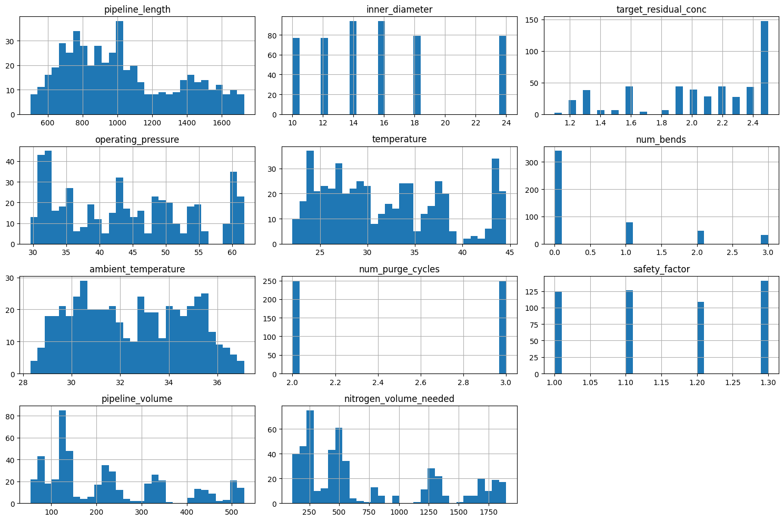
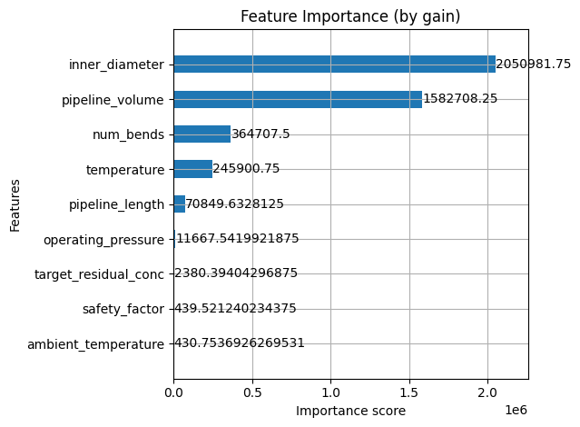

# Nitrogen Purging Estimator
## Project Overview
This project aims to build a machine learning model that predicts the volume of nitrogen required to purge pipelines in oil and gas operations. Nitrogen purging is a critical safety and operational step used to displace hazardous gases before maintenance or commissioning. Traditional estimation methods rely on engineering heuristics, which may be conservative or inconsistent. By leveraging historical, simulated, or expert-driven data, this project provides a data-driven approach to optimize nitrogen usage, reduce costs, and improve planning accuracy.

## Problem Statement
Given pipeline specifications and operating conditions, estimate the volume of nitrogen required for purging. The model considers features such as:
- Pipeline length, diameter, and volume
- Target residual concentration
- Operating and ambient temperature
- Pressure, Safety factor, purge cycle, and number of bends

The target variable is the volume of nitrogen needed, calculated or measured from past operations. The assumed/fixed variables are:
- Purge method (dilution)
- Initial gas Type (Natural gas)

## Dataset Description
There currently exists no data repository for predicting the amount of nitrogen needed for purging a process pipeline. This data is gotten from input from Subject Matter Experts (SMEs) who through their years of experience, were able to give input on the amount of nitrogen to be used given the pipeline data and other variables. The rest of the data is extrapolated to give a good enough amount of dataset for this modelling.

The units of each row are as follows:
1. pipeline_length (m)
2. inner_diameter (inches)
3. target_residual_conc (%HC - Hydrocarbon)
4. operating_pressure (psi)
5. temperature (C)
6. num_bends (-)
7. ambient_temperature (C)
8. num_purge_cycles (-)
9. safety_factor (-)
10. pipeline_volume (m3)

Note: (-) ==> Dimensionless

## EDA Summary




## Modelling Approach, Metrics, and Feature Importance
This problem was approached as a regression problem, aiming to predict the required nitrogen volume based on pipeline and environmental parameters. The modeling pipeline included:
1. Preprocessing: Feature scaling, handling missing values
2. Model Selection: Experimented with three models:
- Decision Tree Regressor
- Random Forest Regressor
- XGBoost Regressor
3. Hyperparameter Tuning: Performed using GridSearchCV to optimize parameters like max_depth, min_samples_leaf, and n_estimators.

The final model was selected based on validation performance

### Evaluation Metrics
Since this is a regression analysis, Root Mean Squared Error (RMSE) was used for model selection and comparison

### Feature Importance


## Tech Stack
- Python 3.13.3
- Pandas, Numpy for data handling
- Scikit-learn, XGBoost for modeling
- Matplotlib, Seaborn for visualization
- FastAPI for deployment
- Docker for containerization

## How to Run the Project Locally
1. Clone the Repository
```bash
git clone https://github.com/Abasi-ifreke/nitrogen-purging.git
cd nitrogen-purging
```

2. Set Up the Environment
Create a virtual environment and install dependencies:
```bash
python -m venv .venv
source .venv/bin/activate  # On Windows:  .venv\Scripts\activate
pip install -r requirements.txt
```

3. Train the model
You can either use the existing model.bin or run the train.py to create a new model.bin
```bash
python train.py
```
This generates the model.bin file and also display the RMSE score in this form:
```bash
Test RMSE: 13.16
```

4. Run the application
To run the application, use uvicorn:
```bash
uvicorn predict:app --host 0.0.0.0 --port 9696 --reload
```

5. Test the application
Test to see the application is running using eith of both options below:
```bash
curl -X POST -H "Content-Type: application/json" \
     -d '{
           "pipeline_length": 800,
           "inner_diameter": 24,
           "target_residual_conc": 2.3,
           "operating_pressure": 50.1,
           "temperature": 35.2,
           "num_bends": 0,
           "ambient_temperature": 30.5,
           "num_purge_cycles": 3,
           "safety_factor": 1.2,
           "pipeline_volume": 233.5
         }' \
     http://localhost:9696/predict
```
or

```bash
python serve.py
```

## How to Run the Project with Docker
1. Build the image
Make sure you're in the directory with the Dockerfile
```bash
docker build -t nitrogen-predictor .
```

2. Confirm the image
```bash
docker images
```

3. Run the container
```bash
docker run -it -p 9696:9696 --name nitrogen-app nitrogen-predictor
```

4. Test the application
```bash
python serve.py
```

## Deployment to the Cloud
This service has been deployed to Google Cloud's Cloud run Service with the url [here](https://purging-app-821515324022.us-central1.run.app/docs).

To test it, substitute the url on serve.py with this `https://purging-app-821515324022.us-central1.run.app/predict` and run the command
```bash
python serve.py
```


To host the application on Google Cloud run:
1. Make sure you have a google cloud account completely set up
2. Download google cloud sdk and complete sdk set up on your local machine
3. Make sure your service account/IAM account has the right permissions
4. On Google Cloud console, Enable Cloud run API
5. Tag and Push your docker image to dockerhub
6. On your terminal, run the code
```bash
gcloud run deploy purging-app --image <docker-image-from-dockerhub> --port 9696 --allow-unauthenticated --region us-central1
```
A service url will be printed on the terminal to access the service

To delete the service on google cloud run, run the command below
```bash
gcloud run services delete purging-app --region us-central1
```